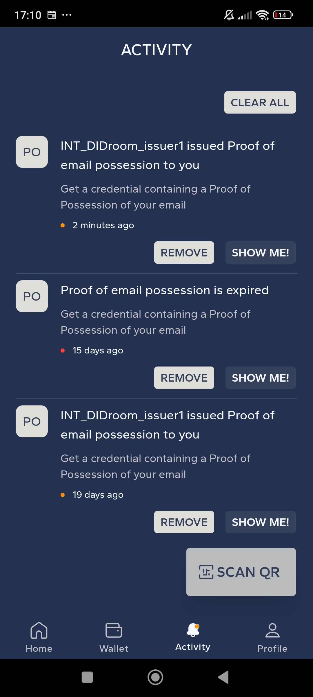

<div align="center">

# DIDroom Wallet Holder App <!-- omit in toc -->

### iOS and Android App for DIDroom Wallet Holders <!-- omit in toc -->

</div>

<p align="center">
   
</p>

A hybrid mobile app built with the Ionic framework and SvelteKit, allowing users to securely handle their credentials and verify them with the DIDroom stack.

---

<br><br>

<div id="toc">

### 🚩 Table of Contents

- [🎮 Quick Start](#-quick-start)
- [📦 Deployment and Testing Strategy](#-deployment-and-testing-strategy)
  - [Request for Testers](#request-for-testers)
- [🚀 Using the Application](#-using-the-application)
  - [Create a New User](#create-a-new-user)
  - [Login](#login)
  - [Settings](#settings)
  - [Permissions](#permissions)
  - [Wallet](#wallet)
  - [Verify Your Credentials](#verify-your-credentials)
  - [Activities](#activities)
- [📸 Screenshots](#-screenshots)
- [🔧 Development](#-development)
  - [Prerequisites](#prerequisites)
  - [Environment Variables](#environment-variables)
  - [Installation](#installation)
  - [Runnnig app in Chrome](#runnnig-app-in-chrome)
- [💄 Theme Configurations](#-theme-configurations)
- [🚨 Test](#-test)
- [👤 Contributing](#-contributing)
- [🚑 Community \& support](#-community--support)
- [😍 Acknowledgements](#-acknowledgements)
  - [Notes](#notes)

</div>

***

## 🎮 Quick Start

Download the latest test release on your Android device and install the APK:


**[🔝 back to top](#toc)**

***

## 📦 Deployment and Testing Strategy

The app follows a structured deployment approach across different environments, allowing for gradual and controlled releases. Below is a breakdown of the deployment intentions and how versioning is managed across different deployment types:

| Deployment Type  | Environment | Version Name                         | Version Code                              |
|------------------|-------------|--------------------------------------|-------------------------------------------|
| github-release   | prod        | Semantic Versioning                  | Semantic versioning without dot           |
| beta             | prod        | Semantic Versioning - beta           | Max version code on PlayStore + 1         |
| alpha            | staging     | Semantic Versioning - alpha          | Max version code on PlayStore + 1         |
| firebase         | staging     | Semantic Versioning - PR number      | PR number                                 |

- **github-release**: Full production release, available to all users through official app stores. Follows semantic versioning without any additional labels.
- **beta**: Limited production release intended for beta testers. The version name will include a `-beta` label, and the version code is incremented from the current max version in the Play Store.
- **alpha**: Early release for staging environments, meant for alpha testers. The version name will include an `-alpha` label, and the version code will increment similarly to beta.
- **firebase**: Used for internal testing and Continuous Integration (CI) with Firebase App Distribution. The version name corresponds to the PR number, and testers receive updates directly via Firebase.

### Request for Testers

To be included as a tester for closed alpha or Firebase releases, please email us at:

📧 **info@forkbomb.eu**

Once added, you will receive instructions on how to download the app and provide feedback.

**[🔝 back to top](#toc)**

***

## 🚀 Using the Application

### Create a New User

Provide an existing email and a password (minimum 8 characters) to create a new user. Generate your own mnemonic phrase by answering security questions. While it is possible to recover the password, the mnemonic phrase is strictly personal and should be stored in a safe place. You can recover the mnemonic phrase by answering the security questions again.

### Login

Login with your email and password. Then, type your mnemonic phrase to access the wallet.

### Settings

In the profile page, you can change language settings or log out the current user.

### Permissions

The app will request permission to access the camera. This is necessary for scanning QR codes.

### Wallet

The wallet is the main page of the app. Here you can see your balance and the list of your credentials. You can also add a new credential by scanning a QR code or by selecting a credential issuer from the list.

### Verify Your Credentials

You can verify your credentials by scanning the QR code from the Verifier App. The app will display the result of the verification and send the result to the verifier. You can review all the data shared with the authorization server before sending it.

### Activities

The activities page shows the history of your interactions with the app. Here you can see the list of credentials obtained or expired and the list of verifications made.

**[🔝 back to top](#toc)**

***

## 📸 Screenshots

<p align="center">
   
   
   
</p>

**[🔝 back to top](#toc)**

***

## 🔧 Development

### Prerequisites

Ensure you have the following tools installed on your machine:

- Node version >= 20.11
- Pnpm
- Java
- Android Studio
- Xcode

Refer to the [Ionic Installation Guide](https://ionicframework.com/docs/installation/cli) for more information.

### Environment Variables

Create a `.env` file in the root of the project containing the `PUBLIC_BACKEND_URL` variable. This is the URL of the DIDroom dashboard. You can clone the dashboard from [here](https://github.com/ForkbombEu/signroom).

### Installation

1. Clone the repository:

    ```bash
    git clone --recursive https://github.com/ForkbombEu/wallet.git
    ```

2. Install dependencies:

    ```bash
    pnpm install
    ```

3. Install the submodules:

    ```bash
    git submodule update --init
    ```

4. Create env variables file:

    ```bash
    cp .env.example .env
    ```


5. Build the web assets:

    ```bash
    pnpm build
    ```

6. Sync dependencies with Capacitor:

    ```bash
    pnpm cap sync
    ```

7. Run the app in the browser (note that it will have some limitations compared to the native app):

    ```bash
    pnpm web
    ```

8. Run the app on Android:

    ```bash
    pnpm android
    ```

9. Run the app on iOS:

    ```bash
    pnpm ios
    ```

### Runnnig app in Chrome

Chrome 142 restricts the ability to make requests to the user's local network, gated behind a permission prompt, thus preventing the web app from functioning properly.

- Open `chrome://flags` in your browser.
- Search for Local Network Access Checks, and disable it.
- Relaunch the browser.


The app should now work properly.

***

## 💄 Theme Configurations

The theme of the app is defined in the `src/theme/variables.css` file. You can change the colors and fonts of the app by defining the following variables for light and dark themes:

```css
--surface
--primary
--primary-text
--secondary-text
--accent
--on-accent
--highlight
--success
--warning
--error
--statusbar
--stroke
--ion-default-font
--ion-font-family
```

For further configuration, clone the didroom-components repository and follow the instructions in the README file. Ensure the app in src/routes/+layout uses the new components.

**[🔝 back to top](#toc)**

***

## 🚨 Test

Install playwright:

```bash
npx playwright install --with-deps
```

In order to launch the tests, you need to install playwright and to have a local copy of the DIDroom dashboard running. You can copy the db for testing contained in `/tests/fixtures/test.db` in `signroom/admin/pb_data/data.db`

then run in that folder:
    
```bash
go build
./pb migrate
./pb serve &
```

Run the tests passing envoiroment variables:

```bash
USER_EMAIL=testuser@test.tv USER_PASSWORD=12345678 USER_SEED="skin buyer sunset person run push elevator under debris soft surge man" pnpm test:integration
```

**[🔝 back to top](#toc)**

***

## 👤 Contributing

Please first take a look at the our [Contributor License Agreement](CONTRIBUTING.md) then

1.  🔀 [FORK IT](../../fork)
2.  Create your feature branch `git checkout -b feature/branch`
3.  Commit your changes `git commit -am 'feat: New feature\ncloses #398'`
4.  Push to the branch `git push origin feature/branch`
5.  Create a new Pull Request `gh pr create -f`
6.  🙏 Thank you


**[🔝 back to top](#toc)**

***
## 🚑 Community & support

**[🌱 Ecosystem](https://forkbomb.solutions/solution/didroom/)** - W3C-DID Dyne, Signroom, Zenroom, Didroom

**[🚩 Issues](../../issues)** - Bugs end errors you encounter using {project_name}.

**[[] Matrix](https://socials.dyne.org/matrix)** - Hanging out with the community.

**[🗣️ Discord](https://socials.dyne.org/discord)** - Hanging out with the community.

**[🪁 Telegram](https://socials.dyne.org/telegram)** - Hanging out with the community.

**[🔝 back to top](#toc)**


***
## 😍 Acknowledgements

Copyleft 🄯 2024 by [Forkbomb](https://www.forkbomb.eu) BV, Amsterdam

Designed by Micol Salomone and Ayse Mete coded by Puria Nafisi Azizi

**[🔝 back to top](#toc)**

***


### Notes

**Path bug**

If you get an error like:

```
SDK location not found. Define a valid SDK location with an ANDROID_HOME environment variable or by setting the sdk.dir path in your project's local properties file at '/Users/<HOME_NAME>/Documents/GitHub/wallet/android/local.properties'.
```

duplicate `android/local.properties.example` as `android/local.properties` and set correct path
